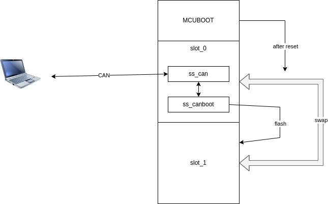

This example relais on the blinky example.
The goal is to demonstrate the flash machanism over CAN in changing the frequency of the blinking led.

---

```c
SS_HANDLE_INIT(ss_canboot_init(0x80, 0x08080000));
```
The `ss_canboot_init()` function is responsible for initialising the system to receive firmwareupdates via CAN.
For this the ss-tool sends a complete binary file word by word to the controller via CAN. A Single id is used 
for that. In this case ID `0x80` is used. `ss_canboot` than writes the received snipets of the image to a 
flasharea. The flasharea is defined by the offset `0x08080000`. After the image is received completely,
a powercycle is required, to perform the mcuboot swap process.

At the moment `ss_canboot_init` is responsible for a 1s delay during startup, because the flasharea 
is erased.

